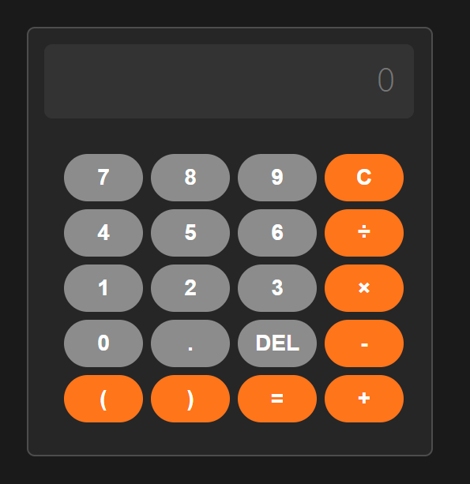

# Calculator App

## Overview
This Calculator App is a clean, intuitive, and responsive web-based calculator built using HTML, CSS, and JavaScript. It supports basic arithmetic operations including addition, subtraction, multiplication, division, and parentheses for grouping expressions.

## Features
- User-friendly interface with a clear display.
- Supports digits (0-9), decimal points, and basic operators (`+`, `-`, `*`, `/`).
- Parentheses for complex expressions.
- Clear (`C`) and delete (`DEL`) functionality.
- Instant calculation with the equals (`=`) button.

## File Structure
- `index.html` — Main HTML file containing the calculator UI.
- `style.css` — Stylesheet for the calculator layout and appearance.
- `script.js` — JavaScript file handling user interactions and calculations.

## Usage
1. Open `index.html` in any modern web browser.
2. Use the buttons to input numbers and operations.
3. Press `=` to calculate the result.
4. Use `C` to clear the display.
5. Use `DEL` to delete the last character.

**Built with care by Ely.**
